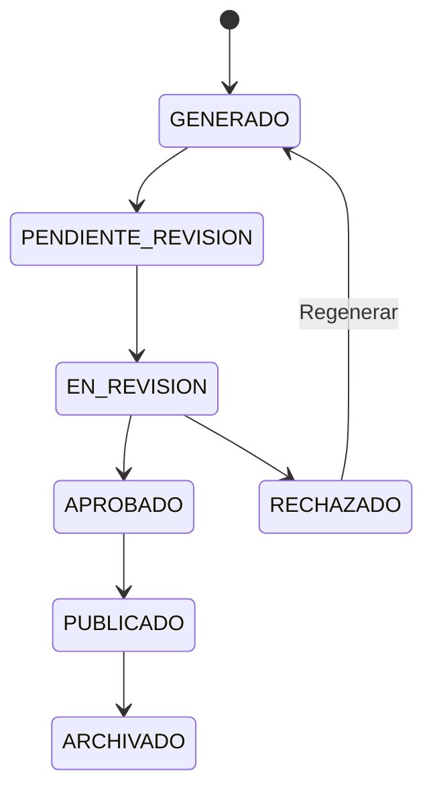

# INSTRUCCIONES PARA MEJORAR ZOOM2 (FASTAPI + NEXT.JS) E IMPLEMENTAR EL MÓDULO DE EVALUACIÓN CIENTÍFICA Y ESTADÍSTICA

## 1. Rol del agente

Actúa como un **arquitecto de software, desarrollador full stack, especialista en calidad de software y analista estadístico** conectado directamente al repositorio del proyecto `zoom2`.

Tu responsabilidad no es limitarte a revisar, recomendar o generar documentación. Debes:

1. Inspeccionar completamente el proyecto actual.
2. Identificar su arquitectura real, dependencias, módulos, flujos y limitaciones.
3. Corregir fallos existentes que afecten la funcionalidad, seguridad, mantenibilidad o coherencia.
4. Implementar las mejoras descritas en este documento.
5. Integrar un módulo completo de evaluación científica.
6. Implementar las pruebas estadísticas necesarias.
7. Crear migraciones, scripts, servicios, vistas, pruebas automatizadas y documentación.
8. Ejecutar y verificar el sistema de extremo a extremo.
9. Entregar evidencia de lo implementado y señalar únicamente los puntos que dependan de credenciales o servicios externos no disponibles.

No debes inventar archivos, tablas, endpoints o funcionalidades que no hayas verificado. Primero inspecciona el repositorio y adapta estas instrucciones a la estructura real del proyecto.

---

# 2. Contexto funcional y tecnológico del proyecto

El proyecto `zoom2` es una aplicación avanzada para la gestión y automatización de reuniones. La solución ya se encuentra desarrollada en una proporción importante y utiliza como arquitectura principal:

- **FastAPI** como backend y API REST.
- **Next.js** como frontend web.
- PostgreSQL, Supabase u otra capa de persistencia ya configurada en el repositorio.
- n8n para automatización de workflows.
- Zoom para integración con reuniones.
- OpenAI u otro proveedor de modelos de lenguaje consumido mediante API.
- Gestión de reuniones y participantes.
- Generación y revisión de resúmenes.
- Gestión de tareas, acuerdos y compromisos.
- Paneles, métricas y reportes.
- Autenticación y autorización.

El agente debe comprobar la estructura y las tecnologías exactas del repositorio antes de modificarlo. Debe respetar, entre otros aspectos:

- si Next.js utiliza App Router o Pages Router;
- si el backend usa SQLAlchemy, SQLModel, Supabase SDK u otro ORM o cliente;
- si existen Alembic u otras migraciones;
- el sistema actual de autenticación;
- las convenciones de rutas, componentes, servicios, repositorios y esquemas;
- las librerías ya instaladas para estado, formularios, tablas, gráficos y llamadas HTTP;
- los contratos actuales entre frontend y backend.

## 2.1. Proyecto avanzado: regla de mejora incremental

**No reconstruyas el proyecto desde cero.** No reemplaces FastAPI, Next.js, la autenticación, la base de datos ni los módulos que ya funcionan por una implementación nueva solamente para ajustarlos a una arquitectura ideal.

Primero debes:

1. identificar lo que ya está implementado;
2. comprobar qué funciona;
3. detectar inconsistencias o deuda técnica;
4. reutilizar los componentes existentes;
5. ampliar la solución mediante cambios incrementales;
6. mantener compatibilidad con los datos y flujos actuales;
7. crear migraciones reversibles;
8. añadir pruebas de regresión antes de refactorizaciones importantes.

Solo refactoriza cuando exista una razón técnica verificable, como duplicación, acoplamiento excesivo, fallos de seguridad, imposibilidad de probar una regla o dificultad real para integrar el módulo estadístico.

## 2.2. Alcance científico correcto

Este proyecto **no entrena redes neuronales propias**. Por tanto, no deben agregarse artificialmente:

- entrenamiento de CNN, RNN o Transformers;
- validación cruzada de redes neuronales;
- archivos `.h5`, `.keras` o checkpoints;
- métricas que no correspondan a una tarea real del sistema;
- matrices de confusión sin un problema de clasificación definido;
- curvas ROC sin puntuaciones o probabilidades válidas.

La investigación debe centrarse en evaluar científicamente:

- calidad y fidelidad de los resúmenes;
- extracción de tareas, acuerdos, responsables y fechas;
- reducción de tiempo frente al procedimiento manual;
- usabilidad;
- acuerdo entre evaluadores;
- confiabilidad del flujo;
- rendimiento;
- efecto sobre el seguimiento de compromisos;
- comparación de prompts, modelos o configuraciones.

El módulo de evaluación y pruebas estadísticas es la **prioridad principal**. Las demás mejoras deben apoyar su validez, seguridad, trazabilidad, mantenibilidad y uso real.

# 3. Objetivo general de la mejora

Convertir `zoom2` en una plataforma sólida, trazable y evaluable científicamente, capaz de demostrar mediante datos si la automatización y la IA generativa:

- reducen el tiempo necesario para elaborar actas;
- mejoran la identificación de acuerdos y tareas;
- producen resúmenes fieles y útiles;
- reducen omisiones y errores;
- mejoran el seguimiento de compromisos;
- ofrecen una experiencia de usuario aceptable;
- mantienen un rendimiento y una confiabilidad adecuados;
- permiten comparar versiones de prompts, modelos o configuraciones;
- generan reportes estadísticos reproducibles.

---

# 4. Resultado esperado y prioridad de trabajo

La prioridad no es ampliar indiscriminadamente todas las funcionalidades del producto. El objetivo principal es implementar una **infraestructura de evaluación científica completa, integrada y reproducible** sobre el proyecto existente.

## 4.1. Prioridad crítica: evaluación y estadística

Al finalizar, el sistema debe permitir:

1. Crear y administrar experimentos.
2. Definir condiciones comparables: manual, versión base, versión mejorada, prompt, modelo o configuración.
3. Registrar participantes, reuniones, evaluadores y mediciones.
4. Evaluar resúmenes mediante una rúbrica.
5. Construir un conjunto de referencia o `gold standard`.
6. Comparar tareas reales con tareas detectadas.
7. Calcular precision, recall y F1.
8. Medir tiempos manuales y tiempos usando zoom2.
9. Aplicar el cuestionario SUS.
10. Medir acuerdo entre evaluadores.
11. Ejecutar pruebas estadísticas según el diseño.
12. Calcular tamaños del efecto.
13. Calcular intervalos de confianza.
14. Aplicar correcciones por comparaciones múltiples.
15. Guardar cada análisis y sus parámetros.
16. Reproducir un análisis previamente ejecutado.
17. Visualizar resultados desde Next.js.
18. Exportar datos anonimizados.
19. Generar reportes PDF, Word y Excel con resultados reales.
20. Validar la calidad y consistencia de los datos antes de analizarlos.

## 4.2. Mejoras de soporte

También debe incluir, en la medida necesaria:

- registro versionado de prompts;
- registro de ejecuciones de IA;
- validación humana de resúmenes;
- historial de versiones;
- trazabilidad entre reunión, transcripción, resumen, acuerdo y tarea;
- auditoría;
- seguridad basada en roles;
- pruebas automatizadas;
- observabilidad;
- documentación técnica y de usuario.

## 4.3. Regla de prioridad

Si el tiempo o la complejidad impiden completar todo simultáneamente, aplica este orden:

1. integridad del modelo de datos experimental;
2. backend de evaluación;
3. motor estadístico;
4. persistencia y reproducibilidad de análisis;
5. frontend de evaluación;
6. frontend de resultados;
7. reportes;
8. mejoras secundarias del producto.

No declares terminado el trabajo si solo se mejoró la interfaz, la arquitectura o el dashboard, pero todavía no es posible ingresar datos reales y ejecutar pruebas estadísticas válidas.

# 5. Principios obligatorios de implementación

## 5.1. No romper funcionalidades existentes

Antes de modificar el sistema:

- identifica los flujos actualmente operativos;
- crea una lista de pruebas de regresión;
- conserva la compatibilidad con las tablas y datos existentes;
- utiliza migraciones incrementales;
- evita cambios destructivos;
- crea respaldos o scripts reversibles cuando corresponda.

## 5.2. No dejar implementaciones simuladas

No deben quedar:

- botones sin acción;
- vistas con datos ficticios;
- funciones con `pass`;
- `TODO` críticos;
- datos estadísticos hardcodeados;
- reportes con números de ejemplo;
- pruebas que siempre pasen sin comprobar comportamiento;
- rutas o nombres de archivos inventados.

## 5.3. Adaptación a la arquitectura FastAPI + Next.js existente

El proyecto ya utiliza FastAPI como backend y Next.js como frontend. La implementación debe integrarse en la organización actual sin imponer una reestructuración total.

Una estructura de referencia, que debe adaptarse al repositorio real, es:

```text
zoom2/
├── backend/
│   ├── app/
│   │   ├── main.py
│   │   ├── api/
│   │   │   ├── dependencies.py
│   │   │   └── v1/
│   │   │       ├── router.py
│   │   │       ├── meetings.py
│   │   │       ├── summaries.py
│   │   │       ├── tasks.py
│   │   │       ├── prompts.py
│   │   │       ├── experiments.py
│   │   │       ├── evaluations.py
│   │   │       ├── analyses.py
│   │   │       └── reports.py
│   │   ├── core/
│   │   │   ├── config.py
│   │   │   ├── security.py
│   │   │   └── logging.py
│   │   ├── models/
│   │   ├── schemas/
│   │   │   ├── experiments.py
│   │   │   ├── evaluations.py
│   │   │   ├── statistics.py
│   │   │   └── reports.py
│   │   ├── repositories/
│   │   ├── services/
│   │   │   ├── experiment_service.py
│   │   │   ├── evaluation_service.py
│   │   │   ├── statistics_service.py
│   │   │   └── report_service.py
│   │   ├── statistics/
│   │   │   ├── descriptive.py
│   │   │   ├── data_quality.py
│   │   │   ├── assumptions.py
│   │   │   ├── hypothesis_tests.py
│   │   │   ├── effect_sizes.py
│   │   │   ├── confidence_intervals.py
│   │   │   ├── reliability.py
│   │   │   └── analysis_selector.py
│   │   ├── integrations/
│   │   ├── reports/
│   │   └── utils/
│   ├── alembic/
│   ├── tests/
│   │   ├── unit/
│   │   ├── integration/
│   │   └── api/
│   ├── requirements.txt o pyproject.toml
│   └── alembic.ini
├── frontend/
│   ├── app/ o pages/
│   │   ├── research/
│   │   │   ├── page.tsx
│   │   │   ├── experiments/
│   │   │   ├── evaluations/
│   │   │   ├── analyses/
│   │   │   └── reports/
│   ├── components/
│   │   └── research/
│   ├── lib/
│   │   ├── api/
│   │   ├── validation/
│   │   └── formatters/
│   ├── hooks/
│   ├── types/
│   ├── tests/
│   ├── package.json
│   └── playwright.config.*
├── docs/
├── docker-compose.yml
└── README.md
```

Esta estructura es orientativa. Si el repositorio es monolítico, usa carpetas con nombres diferentes o posee módulos funcionales consolidados, intégrate en ellos.

## 5.4. Reglas específicas del backend

- Mantén las rutas bajo la versión de API existente.
- Usa esquemas Pydantic para entrada y salida.
- No coloques cálculos estadísticos directamente dentro de los endpoints.
- Separa rutas, validación, servicio, acceso a datos y cálculo estadístico.
- Usa transacciones para operaciones que crean experimentos, mediciones y resultados relacionados.
- Respeta el mecanismo actual de inyección de dependencias.
- Mantén respuestas de error consistentes.
- Documenta los endpoints mediante OpenAPI.
- Implementa paginación, filtros y ordenamiento en listados grandes.
- Evita ejecutar análisis costosos dentro del event loop si bloquean la API; usa el mecanismo de ejecución ya existente o un threadpool/tarea controlada cuando sea necesario.
- No añadas Celery, Redis u otra infraestructura si el proyecto no la necesita y los análisis actuales pueden ejecutarse de forma segura.

## 5.5. Reglas específicas del frontend

- Respeta App Router o Pages Router según lo existente.
- Reutiliza el sistema de componentes, estilos y diseño actual.
- No dupliques clientes HTTP.
- Reutiliza React Query, SWR, Server Actions u otra estrategia existente.
- Implementa formularios con validación coherente con los esquemas del backend.
- Muestra errores de validación y datos insuficientes.
- No calcules resultados inferenciales en el navegador.
- El frontend puede calcular únicamente aspectos visuales o temporales no autoritativos.
- El backend debe ser la fuente de verdad de análisis, métricas y reportes.
- Implementa estados de carga, vacío, error y éxito.
- Las tablas deben soportar filtros, paginación y exportación cuando corresponda.

---

# 6. Fase 0: auditoría obligatoria del proyecto

Antes de implementar, realiza una revisión completa.

## 6.1. Inspección técnica

Revisa como mínimo:

### Backend FastAPI

- punto de entrada y creación de la aplicación;
- routers y versionado de API;
- dependencias de autenticación y autorización;
- modelos ORM;
- esquemas Pydantic;
- repositorios y servicios;
- conexión y pooling de base de datos;
- migraciones existentes;
- tareas de fondo;
- manejo global de excepciones;
- CORS;
- variables de entorno;
- logging;
- pruebas;
- generación de OpenAPI;
- integración con n8n, Zoom y el proveedor de IA.

### Frontend Next.js

- App Router o Pages Router;
- estructura de layouts y rutas;
- autenticación y protección de páginas;
- cliente HTTP;
- manejo de estado;
- formularios y validación;
- componentes de tablas y gráficos;
- sistema de estilos;
- componentes reutilizables;
- variables de entorno públicas y privadas;
- tratamiento de errores;
- pruebas unitarias, de componentes y E2E;
- configuración de construcción y despliegue.

### Persistencia e integraciones

- PostgreSQL, Supabase o tecnología realmente utilizada;
- tablas, restricciones e índices;
- políticas de seguridad;
- integridad referencial;
- datos actuales;
- webhooks;
- idempotencia;
- almacenamiento de transcripciones y reportes;
- trazabilidad de tareas y resúmenes.

### Evaluación científica

- datos que ya se registran;
- datos faltantes para las pruebas;
- posibilidad de diseño pareado;
- identificadores de participante, reunión, condición y evaluador;
- calidad de fechas y duraciones;
- valores faltantes;
- duplicados;
- escalas existentes;
- métricas ya calculadas;
- posibilidades de exportación y anonimización.

## 6.2. Informe previo

Crea `docs/AUDITORIA_INICIAL.md` con:

- arquitectura encontrada;
- componentes y responsabilidades;
- flujo actual;
- tablas existentes;
- riesgos;
- deuda técnica;
- problemas funcionales;
- problemas de seguridad;
- oportunidades de mejora;
- dependencias faltantes;
- plan de implementación por fases.

No detengas el trabajo después del informe. Continúa con la implementación.

---

# 7. Modelo científico del sistema

## 7.1. Pregunta principal de investigación

El sistema debe facilitar la evaluación de una pregunta como:

> ¿En qué medida una plataforma inteligente de gestión de reuniones reduce el tiempo de elaboración de actas y mejora la calidad de los resúmenes, la identificación de acuerdos y el seguimiento de tareas en comparación con un proceso manual?

## 7.2. Variables

### Variable independiente

Debe permitirse registrar una condición experimental:

- `manual`;
- `zoom2_base`;
- `zoom2_mejorado`;
- una versión específica de prompt;
- un modelo de lenguaje específico;
- otra configuración definida por el investigador.

### Variables dependientes

El sistema debe permitir recolectar y analizar:

- tiempo de elaboración del acta;
- tiempo de revisión;
- tiempo total;
- fidelidad;
- cobertura;
- claridad;
- coherencia;
- concisión;
- utilidad;
- cantidad de tareas reales;
- tareas detectadas;
- verdaderos positivos;
- falsos positivos;
- falsos negativos;
- precision;
- recall;
- F1;
- omisiones;
- afirmaciones no respaldadas;
- contradicciones;
- porcentaje de resúmenes aprobados sin cambios;
- tasa de tareas completadas;
- tasa de tareas vencidas;
- latencia del sistema;
- tasa de errores;
- puntuación SUS;
- acuerdo entre evaluadores.

---

# 8. Mejoras en el flujo de resúmenes

## 8.1. Salida estructurada

Modifica el workflow de n8n o el servicio que solicita el resumen para requerir una salida JSON validable.

Estructura sugerida:

```json
{
  "titulo": "Reunión de planificación",
  "resumen_ejecutivo": "Texto breve y fiel a la reunión.",
  "temas": [
    {
      "nombre": "Avance del backend",
      "descripcion": "Se revisó el avance..."
    }
  ],
  "decisiones": [
    {
      "descripcion": "Desplegar el backend en Render",
      "evidencia_textual": "Fragmento o referencia de la transcripción"
    }
  ],
  "acuerdos": [
    {
      "descripcion": "Finalizar el módulo de reportes",
      "responsable": "Nombre identificado",
      "fecha_limite": "2026-08-10",
      "prioridad": "alta",
      "evidencia_textual": "Fragmento de respaldo",
      "confianza": 0.89
    }
  ],
  "riesgos": [
    {
      "descripcion": "Falta de credenciales",
      "impacto": "alto"
    }
  ],
  "preguntas_pendientes": [],
  "advertencias": [
    "No se identificó una fecha límite explícita para determinado acuerdo."
  ]
}
```

## 8.2. Validación del JSON

Implementa:

- validación de esquema;
- manejo de JSON inválido;
- reintento controlado;
- registro del error;
- visualización amigable;
- conservación de la respuesta original;
- prohibición de insertar directamente datos incompletos sin revisión.

Usa modelos de validación o funciones equivalentes. Si se incorpora Pydantic, fija una versión compatible.

## 8.3. Evidencia textual

Cada acuerdo, decisión o tarea debe intentar incluir un fragmento o referencia de la transcripción que lo sustente. Esto permitirá auditar la fidelidad.

No inventes evidencia. Si no existe respaldo claro, registra:

```text
Sin evidencia textual suficiente
```

## 8.4. Estados del resumen

Implementa los estados:

```text
GENERADO
PENDIENTE_REVISION
EN_REVISION
APROBADO
RECHAZADO
PUBLICADO
ARCHIVADO
```

Flujo mínimo:



## 8.5. Revisión humana

Crear una vista donde un usuario autorizado pueda:

- visualizar la transcripción;
- visualizar el resumen original;
- editar el resumen;
- corregir tareas, responsables y fechas;
- marcar errores;
- registrar omisiones;
- aprobar o rechazar;
- solicitar regeneración;
- comparar versiones;
- guardar observaciones.

La versión generada nunca debe sobrescribirse. Cada edición debe crear una nueva versión o registrar los cambios.

---

# 9. Versionado de prompts

Implementa administración de prompts.

## 9.1. Funcionalidades

- Crear prompt.
- Editar mediante nueva versión.
- Activar o desactivar.
- Registrar modelo compatible.
- Registrar propósito.
- Registrar fecha.
- Registrar autor.
- Seleccionar prompt activo.
- Comparar dos versiones.
- Asociar cada ejecución con la versión exacta utilizada.

## 9.2. Regla de inmutabilidad

Una versión de prompt utilizada en una ejecución no debe editarse destructivamente. Para modificarla debe crearse una versión nueva.

Ejemplo:

```text
resumen_reunion v1.0
resumen_reunion v1.1
resumen_reunion v2.0
```

---

# 10. Registro de ejecuciones de IA

Por cada llamada a OpenAI u otro modelo se debe almacenar:

- identificador;
- reunión;
- prompt y versión;
- modelo;
- proveedor;
- temperatura;
- parámetros relevantes;
- fecha y hora;
- duración total;
- tokens de entrada;
- tokens de salida;
- costo estimado, si está disponible;
- estado;
- número de reintentos;
- código o tipo de error;
- respuesta original;
- JSON procesado;
- hash de la entrada;
- versión del workflow;
- usuario o proceso que inició la operación.

No almacenes secretos ni claves de API.

---

# 11. Migraciones de base de datos

Inspecciona primero las tablas existentes y ajusta las claves foráneas a sus nombres reales.

Crea migraciones SQL idempotentes o claramente versionadas. Como mínimo deben existir equivalentes funcionales a las siguientes tablas.

## 11.1. Versiones de prompt

```sql
CREATE TABLE IF NOT EXISTS prompt_versions (
    id uuid PRIMARY KEY DEFAULT gen_random_uuid(),
    nombre varchar(120) NOT NULL,
    version varchar(30) NOT NULL,
    contenido text NOT NULL,
    objetivo text,
    proveedor varchar(80),
    modelo_recomendado varchar(120),
    activo boolean NOT NULL DEFAULT true,
    creado_por uuid,
    fecha_creacion timestamptz NOT NULL DEFAULT now(),
    UNIQUE(nombre, version)
);
```

## 11.2. Ejecuciones de IA

```sql
CREATE TABLE IF NOT EXISTS ai_executions (
    id uuid PRIMARY KEY DEFAULT gen_random_uuid(),
    reunion_id uuid NOT NULL,
    prompt_version_id uuid,
    proveedor varchar(80) NOT NULL,
    modelo varchar(120) NOT NULL,
    temperatura numeric,
    parametros jsonb,
    workflow_version varchar(50),
    input_hash varchar(128),
    respuesta_original text,
    respuesta_procesada jsonb,
    tokens_entrada integer,
    tokens_salida integer,
    costo_estimado numeric(14,6),
    tiempo_ms integer,
    reintentos integer NOT NULL DEFAULT 0,
    estado varchar(30) NOT NULL,
    tipo_error varchar(120),
    mensaje_error text,
    iniciado_por uuid,
    fecha_inicio timestamptz NOT NULL DEFAULT now(),
    fecha_fin timestamptz
);
```

## 11.3. Versiones de resúmenes

```sql
CREATE TABLE IF NOT EXISTS summary_versions (
    id uuid PRIMARY KEY DEFAULT gen_random_uuid(),
    reunion_id uuid NOT NULL,
    ai_execution_id uuid,
    version integer NOT NULL,
    origen varchar(30) NOT NULL,
    contenido text,
    contenido_estructurado jsonb,
    estado varchar(30) NOT NULL DEFAULT 'GENERADO',
    es_version_actual boolean NOT NULL DEFAULT true,
    creado_por uuid,
    fecha_creacion timestamptz NOT NULL DEFAULT now(),
    UNIQUE(reunion_id, version)
);
```

`origen` debe permitir valores como:

```text
IA
HUMANO
REGENERACION
IMPORTACION
```

## 11.4. Evaluaciones de resúmenes

```sql
CREATE TABLE IF NOT EXISTS summary_evaluations (
    id uuid PRIMARY KEY DEFAULT gen_random_uuid(),
    reunion_id uuid NOT NULL,
    summary_version_id uuid NOT NULL,
    evaluador_id uuid NOT NULL,
    fidelidad smallint CHECK (fidelidad BETWEEN 1 AND 5),
    cobertura smallint CHECK (cobertura BETWEEN 1 AND 5),
    claridad smallint CHECK (claridad BETWEEN 1 AND 5),
    coherencia smallint CHECK (coherencia BETWEEN 1 AND 5),
    concision smallint CHECK (concision BETWEEN 1 AND 5),
    utilidad smallint CHECK (utilidad BETWEEN 1 AND 5),
    acuerdos_correctos smallint CHECK (acuerdos_correctos BETWEEN 1 AND 5),
    responsables_correctos smallint CHECK (responsables_correctos BETWEEN 1 AND 5),
    fechas_correctas smallint CHECK (fechas_correctas BETWEEN 1 AND 5),
    omisiones integer NOT NULL DEFAULT 0,
    afirmaciones_no_respaldadas integer NOT NULL DEFAULT 0,
    contradicciones integer NOT NULL DEFAULT 0,
    aprobado_sin_cambios boolean,
    observaciones text,
    fecha_evaluacion timestamptz NOT NULL DEFAULT now(),
    UNIQUE(summary_version_id, evaluador_id)
);
```

## 11.5. Gold standard de tareas

```sql
CREATE TABLE IF NOT EXISTS reference_tasks (
    id uuid PRIMARY KEY DEFAULT gen_random_uuid(),
    reunion_id uuid NOT NULL,
    descripcion text NOT NULL,
    responsable_referencia text,
    fecha_limite_referencia date,
    creado_por uuid NOT NULL,
    validado boolean NOT NULL DEFAULT false,
    fecha_creacion timestamptz NOT NULL DEFAULT now()
);
```

## 11.6. Coincidencias de tareas

```sql
CREATE TABLE IF NOT EXISTS task_evaluation_matches (
    id uuid PRIMARY KEY DEFAULT gen_random_uuid(),
    reunion_id uuid NOT NULL,
    ai_execution_id uuid,
    reference_task_id uuid,
    detected_task_id uuid,
    resultado varchar(10) NOT NULL,
    similitud numeric,
    validado_por uuid,
    observaciones text,
    fecha_registro timestamptz NOT NULL DEFAULT now()
);
```

`resultado` debe admitir:

```text
TP
FP
FN
TN
```

No fuerces `TN` si el universo de “no tareas” no está claramente definido. Para extracción de información suelen ser suficientes TP, FP y FN.

## 11.7. Sesiones experimentales

```sql
CREATE TABLE IF NOT EXISTS experiment_sessions (
    id uuid PRIMARY KEY DEFAULT gen_random_uuid(),
    nombre varchar(160) NOT NULL,
    descripcion text,
    investigador_id uuid NOT NULL,
    condicion varchar(80) NOT NULL,
    prompt_version_id uuid,
    modelo varchar(120),
    fecha_inicio timestamptz NOT NULL DEFAULT now(),
    fecha_fin timestamptz,
    configuracion jsonb,
    estado varchar(30) NOT NULL DEFAULT 'PLANIFICADO'
);
```

## 11.8. Mediciones de tiempo

```sql
CREATE TABLE IF NOT EXISTS time_measurements (
    id uuid PRIMARY KEY DEFAULT gen_random_uuid(),
    experiment_session_id uuid,
    reunion_id uuid NOT NULL,
    participante_id uuid,
    condicion varchar(80) NOT NULL,
    tiempo_elaboracion_segundos integer,
    tiempo_revision_segundos integer,
    tiempo_total_segundos integer,
    errores_detectados integer,
    fecha_registro timestamptz NOT NULL DEFAULT now()
);
```

## 11.9. Evaluación SUS

```sql
CREATE TABLE IF NOT EXISTS sus_responses (
    id uuid PRIMARY KEY DEFAULT gen_random_uuid(),
    experiment_session_id uuid,
    usuario_id uuid NOT NULL,
    q1 smallint NOT NULL CHECK (q1 BETWEEN 1 AND 5),
    q2 smallint NOT NULL CHECK (q2 BETWEEN 1 AND 5),
    q3 smallint NOT NULL CHECK (q3 BETWEEN 1 AND 5),
    q4 smallint NOT NULL CHECK (q4 BETWEEN 1 AND 5),
    q5 smallint NOT NULL CHECK (q5 BETWEEN 1 AND 5),
    q6 smallint NOT NULL CHECK (q6 BETWEEN 1 AND 5),
    q7 smallint NOT NULL CHECK (q7 BETWEEN 1 AND 5),
    q8 smallint NOT NULL CHECK (q8 BETWEEN 1 AND 5),
    q9 smallint NOT NULL CHECK (q9 BETWEEN 1 AND 5),
    q10 smallint NOT NULL CHECK (q10 BETWEEN 1 AND 5),
    puntaje_sus numeric(5,2),
    observaciones text,
    fecha_registro timestamptz NOT NULL DEFAULT now()
);
```

El puntaje SUS debe calcularse correctamente:

- ítems impares: respuesta menos 1;
- ítems pares: 5 menos respuesta;
- sumar contribuciones;
- multiplicar por 2.5;
- resultado entre 0 y 100.

## 11.10. Métricas de rendimiento

```sql
CREATE TABLE IF NOT EXISTS performance_metrics (
    id uuid PRIMARY KEY DEFAULT gen_random_uuid(),
    reunion_id uuid,
    ai_execution_id uuid,
    componente varchar(80) NOT NULL,
    operacion varchar(120) NOT NULL,
    duracion_ms integer,
    exitoso boolean NOT NULL,
    codigo_estado varchar(40),
    mensaje_error text,
    metadata jsonb,
    fecha_registro timestamptz NOT NULL DEFAULT now()
);
```

## 11.11. Auditoría

```sql
CREATE TABLE IF NOT EXISTS audit_log (
    id uuid PRIMARY KEY DEFAULT gen_random_uuid(),
    usuario_id uuid,
    accion varchar(120) NOT NULL,
    entidad varchar(120),
    entidad_id uuid,
    datos_anteriores jsonb,
    datos_nuevos jsonb,
    ip_hash varchar(128),
    fecha timestamptz NOT NULL DEFAULT now()
);
```

## 11.12. Índices

Crea índices para:

- claves foráneas;
- fechas;
- estado;
- reunión;
- evaluador;
- prompt;
- modelo;
- condición experimental.

No crees índices innecesarios sin justificar.

---

# 12. Seguridad y privacidad

## 12.1. Roles

Elimina cualquier autorización basada únicamente en comparar el correo con un valor hardcodeado.

Implementa roles almacenados en base de datos, por ejemplo:

```text
ADMIN
INVESTIGADOR
EVALUADOR
USUARIO
```

Permisos mínimos:

| Acción | ADMIN | INVESTIGADOR | EVALUADOR | USUARIO |
|---|---:|---:|---:|---:|
| Administrar usuarios | Sí | No | No | No |
| Crear experimentos | Sí | Sí | No | No |
| Gestionar prompts | Sí | Sí | No | No |
| Evaluar resúmenes | Sí | Sí | Sí | No |
| Ver resultados agregados | Sí | Sí | Limitado | Limitado |
| Editar sus propias tareas | Sí | Sí | Sí | Sí |

## 12.2. Autorización en base de datos y API

Implementa y documenta la protección de datos según la tecnología real:

- si se usa Supabase, aplica Row Level Security;
- si se usa PostgreSQL directamente, aplica permisos, restricciones y control desde FastAPI;
- valida los permisos nuevamente en el backend, aunque el frontend o la base de datos tengan restricciones;
- evita que un usuario acceda a experimentos, evaluaciones o datos de otros grupos sin autorización;
- registra las decisiones de autorización relevantes.

## 12.3. Datos sensibles

- No expongas transcripciones completas en logs.
- No almacenes credenciales.
- Anonimiza datos para exportación científica.
- Implementa un identificador pseudónimo.
- Registra consentimiento o autorización si el sistema se usará con participantes reales.
- Permite excluir reuniones del conjunto de investigación.
- Implementa eliminación o anonimización controlada.

## 12.4. Exportación de investigación

Al exportar datos:

- sustituye nombres por códigos;
- elimina correos;
- elimina tokens;
- elimina URLs privadas;
- elimina identificadores externos sensibles;
- conserva únicamente las variables necesarias.

---

# 13. Módulo de evaluación de calidad de resúmenes

Crear una vista denominada `Evaluación` o equivalente.

## 13.1. Filtros

- reunión;
- rango de fechas;
- evaluador;
- modelo;
- versión de prompt;
- estado;
- condición experimental;
- tipo de reunión.

## 13.2. Rúbrica

Mostrar criterios de 1 a 5:

1. Fidelidad.
2. Cobertura.
3. Claridad.
4. Coherencia.
5. Concisión.
6. Utilidad.
7. Correcta identificación de acuerdos.
8. Correcta identificación de responsables.
9. Correcta identificación de fechas.

Agregar ayuda contextual:

- `1`: muy deficiente;
- `2`: deficiente;
- `3`: aceptable;
- `4`: bueno;
- `5`: excelente.

## 13.3. Etiquetas de errores

Permitir registrar:

- omisión;
- afirmación no respaldada;
- contradicción;
- responsable incorrecto;
- fecha incorrecta;
- tarea inexistente;
- duplicación;
- redacción ambigua.

## 13.4. Evaluación ciega

Cuando se comparen prompts o modelos, permitir ocultar al evaluador:

- nombre del modelo;
- versión del prompt;
- condición;
- origen del resumen.

Esto reduce sesgo.

## 13.5. Múltiples evaluadores

El sistema debe aceptar al menos dos evaluadores por resumen y luego calcular acuerdo.

---

# 14. Gold standard y evaluación de tareas

## 14.1. Construcción del gold standard

Crear una vista para que un investigador registre manualmente las tareas reales de una reunión:

- descripción;
- responsable;
- fecha límite;
- prioridad;
- evidencia textual;
- observación.

Debe permitirse marcar el conjunto como validado.

## 14.2. Comparación

Comparar tareas detectadas automáticamente con las tareas de referencia.

No bases toda la coincidencia solamente en igualdad literal. Implementa:

1. normalización textual;
2. comparación manual asistida;
3. similitud como sugerencia;
4. confirmación humana final.

La asignación TP, FP y FN debe quedar validada por una persona.

## 14.3. Métricas

Implementa:

```text
precision = TP / (TP + FP)
recall = TP / (TP + FN)
F1 = 2 * precision * recall / (precision + recall)
```

Maneja divisiones entre cero y muestra una explicación.

## 14.4. Métricas adicionales

Cuando existan campos de responsable y fecha:

- exactitud de responsable;
- exactitud de fecha;
- diferencia media en días;
- porcentaje de tareas completas;
- porcentaje de tareas sin responsable;
- porcentaje de tareas sin fecha.

---

# 15. Módulo de medición de tiempo

Debe permitir comparar proceso manual y proceso con `zoom2`.

## 15.1. Registro

Para cada sesión:

- participante;
- reunión;
- condición;
- hora de inicio;
- hora de fin;
- tiempo de elaboración;
- tiempo de revisión;
- tiempo total;
- errores;
- observaciones.

## 15.2. Control experimental

Permitir:

- asignar orden aleatorio;
- registrar grupo;
- registrar si el diseño es pareado;
- registrar exclusiones;
- registrar incidencias.

## 15.3. Indicadores

- media;
- mediana;
- desviación estándar;
- rango intercuartílico;
- mínimo;
- máximo;
- reducción absoluta;
- reducción porcentual;
- intervalo de confianza.

---

# 16. Cuestionario de usabilidad SUS

Implementa el cuestionario SUS estándar de diez ítems con escala de 1 a 5.

No cambies el sentido de los ítems sin documentarlo. Si se muestra una traducción al español, conserva la estructura estándar y documenta la fuente usada por el proyecto.

## 16.1. Resultado

Mostrar:

- puntaje individual;
- promedio;
- mediana;
- desviación;
- intervalo de confianza;
- distribución;
- cantidad de respuestas.

No etiquetes automáticamente el sistema como “excelente” únicamente por un umbral. Presenta los resultados con prudencia y contexto.

## 16.2. Consistencia interna

Implementa alfa de Cronbach como análisis auxiliar del cuestionario.

---

# 17. Módulo estadístico

Crear una capa estadística reutilizable y separada de la interfaz.

## 17.1. Dependencias

No reemplaces el sistema actual de gestión de dependencias. Si el backend usa `pyproject.toml`, Poetry, uv o Pipenv, intégrate en él. Si usa `requirements.txt`, actualízalo de forma compatible.

### Backend: dependencias estadísticas sugeridas

```text
numpy
pandas
scipy
statsmodels
scikit-learn
matplotlib
openpyxl
python-docx
krippendorff
```

Según la arquitectura existente, también pueden ser necesarios:

```text
fastapi
uvicorn
pydantic
sqlalchemy
alembic
httpx
```

No dupliques dependencias que ya existen. Fija versiones solo después de ejecutar pruebas de compatibilidad.

### Backend: dependencias de desarrollo

```text
pytest
pytest-cov
pytest-mock
pytest-asyncio
httpx
ruff
mypy
locust
```

### Frontend

Revisa el `package.json` actual. Reutiliza las herramientas ya instaladas. Para pruebas y visualización pueden utilizarse, solamente si no existe una alternativa equivalente:

```text
vitest o jest
@testing-library/react
@testing-library/jest-dom
playwright
zod
recharts, chart.js, nivo o la librería gráfica existente
```

No instales varias librerías que resuelvan el mismo problema. La decisión debe ajustarse al stack real.

## 17.1.1. Separación de responsabilidades

- Python/FastAPI ejecuta y persiste los análisis.
- Next.js presenta formularios, tablas, gráficos y reportes.
- La base de datos conserva datos, configuraciones y resultados.
- Los resultados estadísticos no deben depender de estado temporal del navegador.
- Cada análisis debe poder repetirse sin depender de la sesión de interfaz.

## 17.1.2. Validación previa de datos

Antes de ejecutar cualquier prueba, crea un reporte de calidad que incluya:

- número total de registros;
- registros utilizables;
- duplicados;
- valores faltantes;
- valores fuera de rango;
- pares incompletos;
- condiciones sin observaciones;
- evaluadores faltantes;
- escalas inconsistentes;
- duraciones negativas o imposibles;
- identificadores huérfanos;
- exclusiones y motivo de exclusión.

El motor debe impedir la ejecución cuando:

- no exista el mínimo matemático de observaciones;
- una condición esté vacía;
- el diseño se marque como pareado pero no existan pares identificables;
- las variables no correspondan a la prueba;
- todos los valores sean idénticos y la prueba no pueda calcularse;
- existan errores estructurales que invaliden el análisis.

Debe permitir continuar con advertencias cuando los datos sean analizables pero limitados.

## 17.1.3. Persistencia y reproducibilidad de análisis

Implementa entidades equivalentes a:

```sql
CREATE TABLE IF NOT EXISTS statistical_analyses (
    id uuid PRIMARY KEY DEFAULT gen_random_uuid(),
    experiment_session_id uuid NOT NULL,
    nombre varchar(180) NOT NULL,
    objetivo text,
    variable_resultado varchar(120) NOT NULL,
    variable_grupo varchar(120),
    diseno varchar(40) NOT NULL,
    prueba_solicitada varchar(80),
    prueba_ejecutada varchar(80) NOT NULL,
    alpha numeric(6,5) NOT NULL DEFAULT 0.05,
    correccion_multiple varchar(40),
    filtros jsonb NOT NULL DEFAULT '{}'::jsonb,
    configuracion jsonb NOT NULL DEFAULT '{}'::jsonb,
    estado varchar(30) NOT NULL,
    datos_hash varchar(128),
    codigo_version varchar(80),
    creado_por uuid NOT NULL,
    fecha_creacion timestamptz NOT NULL DEFAULT now(),
    fecha_ejecucion timestamptz
);

CREATE TABLE IF NOT EXISTS statistical_analysis_results (
    id uuid PRIMARY KEY DEFAULT gen_random_uuid(),
    analysis_id uuid NOT NULL,
    resultado jsonb NOT NULL,
    descriptivos jsonb,
    supuestos jsonb,
    efecto jsonb,
    intervalos jsonb,
    advertencias jsonb,
    interpretacion text,
    fecha_registro timestamptz NOT NULL DEFAULT now()
);
```

Cada resultado debe guardar, como mínimo:

- datos o consulta de origen;
- filtros;
- prueba;
- parámetros;
- versión del código;
- semilla aleatoria;
- resultado numérico sin redondear;
- resultado presentado;
- advertencias;
- exclusiones;
- fecha.


## 17.2. Estadísticos descriptivos

Implementa funciones para:

- n;
- media;
- mediana;
- moda, cuando sea útil;
- desviación estándar;
- varianza;
- mínimo;
- máximo;
- cuartiles;
- rango intercuartílico;
- percentiles;
- coeficiente de variación, cuando corresponda;
- intervalos de confianza bootstrap.

## 17.3. Pruebas de supuestos

Implementa:

- Shapiro-Wilk para normalidad de diferencias cuando el diseño sea pareado;
- inspección gráfica mediante histograma y Q-Q plot;
- Levene o Brown-Forsythe para igualdad de varianzas cuando aplique;
- detección y reporte de valores extremos sin eliminarlos automáticamente.

No elijas una prueba únicamente por el resultado de Shapiro. Considera tamaño de muestra, diseño y distribución.

## 17.4. Comparación de dos condiciones pareadas

Para comparar, por ejemplo, tiempo manual frente a zoom2:

- t de Student para muestras relacionadas si es razonable;
- Wilcoxon de rangos con signo como alternativa no paramétrica.

Reportar:

- estadístico;
- valor p;
- diferencia media o mediana;
- intervalo de confianza;
- tamaño del efecto;
- cantidad de pares;
- datos faltantes;
- interpretación.

Tamaños del efecto:

- Cohen’s dz para t pareada;
- correlación biserial de rangos o `r = Z / sqrt(N)` para Wilcoxon.

## 17.5. Dos condiciones independientes

Cuando los participantes sean distintos:

- t de Welch;
- Mann-Whitney U como alternativa no paramétrica.

No uses t de Student con varianzas iguales por defecto.

## 17.6. Tres o más condiciones relacionadas

- ANOVA de medidas repetidas si aplica;
- Friedman como alternativa no paramétrica;
- comparaciones post hoc por pares;
- corrección de Holm.

Reportar tamaño del efecto:

- eta cuadrado parcial para ANOVA;
- Kendall’s W para Friedman.

## 17.7. Datos binarios pareados

Para comparar error/no error entre dos configuraciones:

- McNemar.

Para tres o más configuraciones:

- Q de Cochran.

## 17.8. Datos categóricos independientes

- chi-cuadrado;
- prueba exacta de Fisher cuando los recuentos esperados sean pequeños;
- V de Cramér como tamaño del efecto.

## 17.9. Acuerdo entre evaluadores

Implementa:

- Cohen’s kappa para dos evaluadores y categorías;
- Krippendorff’s alpha, preferentemente ordinal para escalas de 1 a 5;
- coeficiente de correlación intraclase si el diseño lo permite.

El sistema debe indicar:

- tipo de datos;
- número de evaluadores;
- datos faltantes;
- método seleccionado;
- valor obtenido;
- interpretación prudente.

## 17.10. Correlaciones

Cuando se analicen relaciones como duración de reunión frente a errores:

- Pearson si corresponde;
- Spearman como alternativa robusta.

Reportar intervalo de confianza cuando sea posible.

## 17.11. Rendimiento

Para latencia:

- P50;
- P90;
- P95;
- P99;
- promedio;
- mediana;
- tasa de éxito;
- tasa de fallos;
- errores por componente.

## 17.12. Corrección por comparaciones múltiples

Aplicar Holm como opción predeterminada cuando se realicen múltiples comparaciones.

## 17.13. Nivel de significancia

Permitir configurar:

```text
alpha = 0.05
```

No convertir el valor p en la única conclusión. Siempre reportar:

- magnitud del efecto;
- intervalo de confianza;
- relevancia práctica;
- limitaciones.

---

# 18. Selector automático de prueba estadística

Implementa un asistente que recomiende una prueba según:

- tipo de variable;
- número de condiciones;
- muestras pareadas o independientes;
- cantidad de grupos;
- distribución;
- tamaño de muestra;
- presencia de datos faltantes.

El asistente debe explicar la recomendación, pero el investigador debe poder cambiarla.

Ejemplo:

```text
Pregunta: ¿Los mismos participantes fueron evaluados en ambas condiciones?
Sí.

Número de condiciones: 2.
Variable: tiempo continuo.
Normalidad aproximada de las diferencias: no.

Prueba sugerida: Wilcoxon de rangos con signo.
```

No ejecutes automáticamente una prueba incorrecta si faltan datos críticos. Muestra una advertencia clara.

---

# 19. Interpretación automática controlada

Genera interpretaciones mediante plantillas deterministas, no mediante afirmaciones libres no verificadas.

Ejemplo:

```text
La mediana del tiempo total fue de 1 420 segundos en la condición manual y
460 segundos utilizando zoom2. La reducción mediana observada fue de 960
segundos. La prueba de Wilcoxon produjo W = X y p = Y. El tamaño del efecto fue
r = Z. Estos resultados indican una diferencia estadística acompañada de un
efecto [pequeño/moderado/grande], dentro de las limitaciones del tamaño y diseño
de la muestra.
```

Reglas:

- no afirmar causalidad en estudios observacionales;
- no afirmar ausencia de efecto solamente porque `p > 0.05`;
- no usar “100 % confiable”;
- no ocultar datos faltantes;
- no eliminar outliers sin justificación;
- mostrar advertencias cuando el tamaño de muestra sea reducido.

---


# 19.1. API del módulo de investigación

Implementa endpoints integrados en la versión actual de FastAPI. Los nombres exactos pueden adaptarse, pero debe existir equivalencia funcional.

## Experimentos

```text
POST   /api/v1/research/experiments
GET    /api/v1/research/experiments
GET    /api/v1/research/experiments/{id}
PATCH  /api/v1/research/experiments/{id}
POST   /api/v1/research/experiments/{id}/start
POST   /api/v1/research/experiments/{id}/close
```

## Mediciones y evaluaciones

```text
POST   /api/v1/research/time-measurements
GET    /api/v1/research/time-measurements
POST   /api/v1/research/summary-evaluations
GET    /api/v1/research/summary-evaluations
POST   /api/v1/research/sus-responses
GET    /api/v1/research/sus-responses
```

## Gold standard y tareas

```text
POST   /api/v1/research/reference-tasks
GET    /api/v1/research/reference-tasks
POST   /api/v1/research/task-matches
PATCH  /api/v1/research/task-matches/{id}
GET    /api/v1/research/task-metrics
```

## Análisis estadístico

```text
POST   /api/v1/research/analyses/validate
POST   /api/v1/research/analyses
GET    /api/v1/research/analyses
GET    /api/v1/research/analyses/{id}
POST   /api/v1/research/analyses/{id}/rerun
GET    /api/v1/research/analyses/{id}/results
```

## Reportes y exportaciones

```text
POST   /api/v1/research/reports
GET    /api/v1/research/reports/{id}
GET    /api/v1/research/exports/data
```

Requisitos:

- control de acceso por rol;
- validación Pydantic;
- respuestas tipadas;
- paginación;
- filtros;
- OpenAPI;
- códigos HTTP correctos;
- errores con mensajes utilizables;
- pruebas de contrato;
- idempotencia donde aplique.

# 19.2. Interfaz Next.js del módulo de investigación

Implementa una sección integrada al menú actual, por ejemplo `/research`.

Debe incluir:

```text
/research
/research/experiments
/research/experiments/new
/research/experiments/[id]
/research/evaluations
/research/gold-standard
/research/analyses
/research/analyses/[id]
/research/reports
/research/settings/prompts
```

## Flujo principal

1. Crear experimento.
2. Definir objetivo y diseño.
3. Seleccionar condiciones.
4. Incorporar reuniones y participantes.
5. Registrar mediciones.
6. Evaluar resúmenes.
7. Crear o validar gold standard.
8. Revisar calidad de datos.
9. Seleccionar o aceptar prueba sugerida.
10. Ejecutar análisis.
11. Revisar resultados, advertencias y tamaños del efecto.
12. Generar reporte.

## Componentes mínimos

- asistente de creación de experimento;
- tabla de mediciones;
- formulario de evaluación;
- comparador de resumen y transcripción;
- constructor del gold standard;
- matriz de coincidencias de tareas;
- panel de calidad de datos;
- selector de análisis;
- vista de resultados;
- gráficos;
- exportación;
- historial reproducible.

Las vistas deben consumir el backend real. No uses datos estáticos salvo fixtures de pruebas.


# 20. Dashboard de investigación

Crear una vista posterior al login con permisos de investigador.

## 20.1. Indicadores

- reuniones procesadas;
- resúmenes evaluados;
- evaluaciones pendientes;
- promedio de fidelidad;
- promedio de utilidad;
- tasa de aprobación sin cambios;
- precision de tareas;
- recall de tareas;
- F1 de tareas;
- tasa de afirmaciones no respaldadas;
- reducción de tiempo;
- puntaje SUS;
- latencia P95;
- tasa de error;
- cantidad de prompts;
- cantidad de modelos evaluados.

## 20.2. Gráficos

- distribución de puntuaciones;
- boxplot por prompt;
- boxplot por modelo;
- evolución temporal;
- matriz de confusión o tabla TP/FP/FN;
- curva Precision-Recall solo si existe una puntuación de confianza válida;
- mapa de calor de correlaciones;
- gráfico de acuerdo entre evaluadores;
- latencia por componente;
- tasa de errores;
- tareas completadas y vencidas;
- comparación manual frente a zoom2.

## 20.3. Filtros

Todos los indicadores deben responder a filtros:

- experimento;
- fechas;
- prompt;
- modelo;
- condición;
- evaluador;
- tipo de reunión;
- estado.

## 20.4. Interpretación

Cada gráfico debe mostrar:

- qué representa;
- cómo se calcula;
- qué limitaciones tiene;
- interpretación de los resultados actuales.

---

# 21. Reportes

Implementa exportación en:

- PDF;
- Word;
- Excel.

## 21.1. Contenido mínimo

1. Portada.
2. Identificador del experimento.
3. Fecha.
4. Versión del sistema.
5. Configuraciones comparadas.
6. Descripción de la muestra.
7. Criterios de inclusión y exclusión.
8. Datos faltantes.
9. Estadísticos descriptivos.
10. Pruebas de supuestos.
11. Prueba estadística seleccionada.
12. Hipótesis.
13. Resultado.
14. Tamaño del efecto.
15. Intervalo de confianza.
16. Tablas.
17. Figuras.
18. Interpretación.
19. Limitaciones.
20. Conclusiones.
21. Anexo de parámetros.
22. Hash o identificador de reproducibilidad.

## 21.2. Excel

Crear hojas separadas:

```text
Resumen
Datos
Descriptivos
Pruebas
Efectos
Intervalos
Evaluadores
Tareas
Rendimiento
Configuración
```

## 21.3. Reproducibilidad

Cada reporte debe registrar:

- fecha de generación;
- filtros aplicados;
- versión del código, si puede obtenerse del commit;
- versión del prompt;
- versión del workflow;
- modelo;
- parámetros;
- nivel alfa;
- método de corrección;
- semilla usada en bootstrap, cuando aplique.

---

# 22. Pruebas de software

## 22.1. Backend: pruebas unitarias

Implementa pruebas para:

- cálculo SUS;
- precision, recall y F1;
- alfa de Cronbach;
- kappa y Krippendorff;
- pruebas de hipótesis;
- tamaños del efecto;
- intervalos bootstrap;
- corrección de Holm;
- selección de prueba;
- validación de calidad de datos;
- validación de JSON;
- cambios de estado;
- permisos;
- versionado de prompts;
- interpretación estadística;
- anonimización;
- serialización de resultados.

Incluye datasets pequeños con resultados conocidos y compara contra valores esperados con tolerancias numéricas explícitas.

## 22.2. Backend: pruebas de API e integración

Usa las herramientas compatibles con FastAPI, por ejemplo `pytest`, `httpx` y `TestClient` o clientes asíncronos.

Prueba:

- creación y cierre de experimentos;
- validación de permisos;
- persistencia de evaluaciones;
- creación del gold standard;
- registro de TP, FP y FN;
- validación previa al análisis;
- ejecución estadística;
- reejecución reproducible;
- generación de reportes;
- transacciones;
- PostgreSQL/Supabase mediante entorno de prueba o mocks bien delimitados;
- n8n y proveedor de IA mediante respuestas simuladas realistas;
- manejo global de errores.

## 22.3. Frontend: pruebas unitarias y de componentes

Prueba:

- formularios;
- validación;
- filtros;
- estados de carga;
- estados vacíos;
- errores de API;
- representación de valores nulos;
- tablas;
- advertencias estadísticas;
- selección de prueba;
- visualización de resultados;
- permisos de navegación.

No pruebes solamente snapshots. Verifica comportamiento y accesibilidad.

## 22.4. Pruebas end-to-end

Usa Playwright o la herramienta E2E existente.

Flujos mínimos:

1. Login.
2. Crear experimento.
3. Registrar o seleccionar reunión.
4. Procesar transcripción.
5. Generar resumen.
6. Revisar y aprobar resumen.
7. Crear gold standard.
8. Evaluar tareas.
9. Registrar mediciones manuales y automáticas.
10. Completar SUS.
11. Validar calidad de datos.
12. Ejecutar análisis.
13. Consultar resultados.
14. Descargar reporte.
15. Reejecutar análisis guardado.

## 22.5. Casos negativos

- credenciales inválidas;
- rol sin permisos;
- transcripción vacía;
- JSON inválido;
- timeout;
- reunión inexistente;
- resumen duplicado;
- edición concurrente;
- experimento cerrado;
- datos insuficientes;
- pares incompletos;
- división por cero;
- escala fuera de rango;
- todos los valores iguales;
- reporte sin datos;
- pérdida temporal de base de datos;
- webhook duplicado;
- fecha inválida;
- responsable inexistente;
- frontend sin conexión con el backend;
- análisis solicitado con una variable incompatible.

## 22.6. Regresión y cobertura

Configura cobertura separada para:

- backend;
- frontend;
- motor estadístico.

Prioriza reglas de negocio, seguridad, validaciones, servicios estadísticos y endpoints críticos.

No establezcas una cifra alta de cobertura como único criterio. Exige que los casos importantes estén probados.

---

# 23. Logging y observabilidad

Implementa logging estructurado.

Registrar:

- componente;
- operación;
- identificador de correlación;
- reunión;
- ejecución;
- duración;
- resultado;
- error.

No registrar:

- contraseñas;
- tokens;
- claves;
- transcripciones completas;
- datos personales innecesarios.

Agregar mensajes comprensibles al usuario y detalles técnicos en logs seguros.

---

# 24. Mejora de la módulo o página de tareas

La vista existente debe conservar y mejorar:

- métricas;
- filtros;
- tabla;
- creación;
- edición;
- asignación;
- estados;
- fechas.

Agregar:

- historial de cambios;
- origen de la tarea: manual o IA;
- reunión de origen;
- acuerdo relacionado;
- evidencia textual;
- confianza de extracción;
- validación humana;
- prioridad;
- responsable;
- fecha límite;
- estado;
- fecha real de conclusión;
- indicador de vencimiento;
- auditoría.

Estados sugeridos:

```text
PENDIENTE
EN_PROGRESO
BLOQUEADA
COMPLETADA
CANCELADA
```

Implementa análisis de:

- porcentaje completado;
- porcentaje vencido;
- tiempo medio de cierre;
- tareas sin responsable;
- tareas sin fecha;
- tasa de corrección de tareas generadas por IA.

---

# 25. Mejora del dashboard general

Después de validar credenciales, mostrar:

- resumen de reuniones;
- reuniones recientes;
- tareas pendientes;
- tareas vencidas;
- resúmenes pendientes de revisión;
- estado de workflows;
- fallos recientes;
- indicadores de uso;
- accesos rápidos;
- alertas.

El dashboard de investigación debe estar separado o condicionado por rol.

---

# 26. Documentación

Genera o actualiza:

```text
README.md
docs/MANUAL_INSTALACION.md
docs/MANUAL_USUARIO.md
docs/MANUAL_INVESTIGADOR.md
docs/MODELO_ESTADISTICO.md
docs/DICCIONARIO_DATOS.md
docs/ARQUITECTURA.md
docs/API_INVESTIGACION.md
docs/SEGURIDAD_PRIVACIDAD.md
docs/PLAN_PRUEBAS.md
docs/REPRODUCIBILIDAD.md
docs/INTEGRACION_N8N.md
docs/DESPLIEGUE.md
docs/AUDITORIA_INICIAL.md
docs/RESULTADO_IMPLEMENTACION.md
```

## 26.1. Diagramas Mermaid

Incluye:

- arquitectura;
- componentes;
- modelo de datos;
- secuencia de generación de resumen;
- secuencia de evaluación;
- secuencia de análisis estadístico;
- estados del resumen;
- estados de tarea;
- despliegue.

---

# 27. Despliegue

La arquitectura objetivo ya está definida:

- **FastAPI** como backend;
- **Next.js** como frontend;
- base de datos existente;
- n8n para workflows;
- servicios externos de Zoom e IA.

## 27.1. Backend FastAPI

Preparar despliegue compatible con Render u otra infraestructura existente:

- comando de inicio con Uvicorn o Gunicorn/Uvicorn workers;
- health check, por ejemplo `/health`;
- migraciones antes o durante el despliegue de forma segura;
- variables de entorno;
- CORS restringido al dominio real;
- logs estructurados;
- límites de tiempo;
- tratamiento de tareas estadísticas;
- almacenamiento persistente de reportes si aplica.

Ejemplo orientativo:

```text
uvicorn app.main:app --host 0.0.0.0 --port $PORT
```

Adapta la ruta al repositorio real.

## 27.2. Frontend Next.js

Preparar despliegue en Vercel o la plataforma ya utilizada:

- variable del URL público de la API;
- compilación sin errores;
- separación de variables públicas y privadas;
- protección de rutas;
- manejo de CORS y cookies;
- configuración de dominios;
- páginas de error;
- verificación del consumo de reportes.

## 27.3. Entorno local

Si existe Docker Compose, actualízalo para iniciar:

- backend;
- frontend;
- base de datos o conexión correspondiente;
- servicios auxiliares realmente necesarios.

Crea o actualiza:

- `.env.example` del backend;
- `.env.example` del frontend;
- documentación de variables;
- health checks;
- instrucciones de despliegue;
- verificación posterior;
- estrategia de migración y rollback.

No reemplaces el despliegue actual si ya funciona. Corrígelo y amplíalo.

---

# 28. CI/CD

Agregar o mejorar GitHub Actions para:

### Backend

- instalación de Python;
- lint;
- type checking;
- migraciones en entorno de prueba;
- pruebas unitarias;
- pruebas de API;
- cobertura;
- validación de importaciones.

### Frontend

- instalación con el gestor existente;
- lint;
- type checking;
- pruebas de componentes;
- construcción de Next.js;
- pruebas E2E cuando sea viable.

### General

- detección básica de secretos;
- ejecución en pull requests;
- caché de dependencias;
- publicación de artefactos de cobertura;
- bloqueo del merge cuando fallen pruebas críticas.

No publiques credenciales.

---

# 29. Criterios de aceptación

La implementación se considera completa cuando:

- [ ] El backend FastAPI inicia sin errores.
- [ ] El frontend Next.js compila e inicia sin errores.
- [ ] El frontend consume la API real sin datos simulados.
- [ ] OpenAPI documenta los endpoints de investigación.
- [ ] Las migraciones se ejecutan correctamente.
- [ ] El sistema inicia sin errores.
- [ ] El login funciona.
- [ ] Los roles no dependen de un correo hardcodeado.
- [ ] Los prompts tienen versiones inmutables.
- [ ] Cada ejecución de IA queda registrada.
- [ ] Los errores y tiempos quedan registrados.
- [ ] El resumen conserva su versión original.
- [ ] Se puede revisar, corregir, aprobar y rechazar.
- [ ] Las tareas extraídas incluyen trazabilidad.
- [ ] Se puede crear un gold standard.
- [ ] Se calculan TP, FP y FN.
- [ ] Se calculan precision, recall y F1.
- [ ] Se registran mediciones manuales y automáticas.
- [ ] Se calcula SUS correctamente.
- [ ] Se evalúa acuerdo entre jueces.
- [ ] Se valida la calidad de los datos antes de analizar.
- [ ] Se ejecutan pruebas pareadas e independientes.
- [ ] Se guardan los parámetros y resultados de cada análisis.
- [ ] Se puede reejecutar un análisis guardado.
- [ ] Se impide ejecutar pruebas incompatibles o sin datos suficientes.
- [ ] Se reportan tamaños del efecto.
- [ ] Se reportan intervalos de confianza.
- [ ] Se corrigen comparaciones múltiples.
- [ ] El dashboard responde a filtros.
- [ ] PDF, Word y Excel contienen resultados reales.
- [ ] Los reportes incluyen interpretación.
- [ ] Existen pruebas unitarias del backend y del motor estadístico.
- [ ] Existen pruebas de API FastAPI.
- [ ] Existen pruebas de componentes Next.js.
- [ ] Existen pruebas de integración.
- [ ] Los flujos principales tienen pruebas E2E.
- [ ] La documentación está actualizada.
- [ ] No se exponen secretos.
- [ ] Las exportaciones de investigación se anonimizan.
- [ ] El sistema conserva las funcionalidades previas.

---

# 30. Entregables finales del agente

Al terminar, genera `docs/RESULTADO_IMPLEMENTACION.md` con:

## 30.1. Resumen

- qué se implementó;
- qué se corrigió;
- qué se refactorizó;
- qué se mantuvo.

## 30.2. Archivos modificados

Lista exacta de archivos creados, modificados o eliminados.

## 30.3. Base de datos

- migraciones;
- tablas;
- índices;
- políticas;
- instrucciones de ejecución.

## 30.4. Pruebas

- comandos ejecutados;
- resultados;
- cobertura;
- fallos corregidos;
- limitaciones.

## 30.5. Estadística

- pruebas implementadas;
- criterios de selección;
- tamaños del efecto;
- intervalos;
- correcciones;
- supuestos.

## 30.6. Ejecución

Documenta comandos exactos según la estructura real. Como referencia:

### Backend — PowerShell

```powershell
cd backend
python -m venv .venv
.\.venv\Scripts\Activate.ps1
python -m pip install --upgrade pip
pip install -r requirements.txt
alembic upgrade head
pytest
uvicorn app.main:app --reload
```

Si se usa `pyproject.toml`, Poetry, uv u otro gestor, utiliza sus comandos reales.

### Frontend — PowerShell

```powershell
cd frontend
npm install
npm run lint
npm run test
npm run build
npm run dev
```

Sustituye `npm` por `pnpm` o `yarn` si el proyecto ya utiliza otro gestor.

### Pruebas E2E

```powershell
cd frontend
npx playwright test
```

No documentes comandos que no hayas verificado.

## 30.7. Pendientes externos

Incluye solamente tareas que no puedan completarse sin:

- credenciales;
- acceso a la base de datos o Supabase;
- acceso a n8n;
- acceso a Zoom;
- acceso al proveedor de IA;
- configuración del despliegue.

No utilices la falta de credenciales como razón para no implementar interfaces, servicios, pruebas con mocks, migraciones o documentación.

---

# 31. Orden obligatorio de ejecución

Sigue este orden:

1. Inspección completa del backend FastAPI y frontend Next.js.
2. Auditoría y mapa de funcionalidades existentes.
3. Pruebas de regresión de los flujos actuales.
4. Estrategia de migración y respaldo.
5. Modelo de datos experimental.
6. Seguridad y permisos del módulo de investigación.
7. Migraciones.
8. Endpoints FastAPI de experimentos y evaluaciones.
9. Captura de datos de calidad.
10. Gold standard y métricas de tareas.
11. Mediciones de tiempo.
12. SUS y acuerdo entre evaluadores.
13. Motor estadístico.
14. Persistencia de análisis y reproducibilidad.
15. Frontend Next.js de evaluación.
16. Frontend Next.js de análisis y resultados.
17. Dashboard de investigación.
18. Reportes.
19. Versionado de prompts y registro de ejecuciones, si aún no existe.
20. Pruebas backend, frontend y E2E.
21. CI/CD.
22. Documentación.
23. Verificación end-to-end.
24. Informe final.

No pospongas el motor estadístico hasta después de mejoras visuales no esenciales.

---


# 31.1. Implementación estadística mínima que debe quedar operativa

Antes de considerar mejoras opcionales, debe funcionar de extremo a extremo al menos este conjunto:

## Caso A: tiempo manual frente a zoom2

- registro de pares por participante y reunión;
- validación de pares completos;
- descriptivos;
- Shapiro-Wilk de las diferencias como información auxiliar;
- t pareada o Wilcoxon;
- diferencia y reducción porcentual;
- tamaño del efecto;
- intervalo de confianza;
- resultado persistido;
- gráfico y reporte.

## Caso B: calidad de dos configuraciones de resumen

- dos evaluaciones sobre las mismas reuniones;
- criterios ordinales de 1 a 5;
- Wilcoxon o prueba compatible;
- corrección de Holm si se comparan varios criterios;
- efecto;
- acuerdo entre evaluadores;
- reporte.

## Caso C: extracción de tareas

- gold standard;
- TP, FP y FN validados;
- precision, recall y F1;
- intervalos bootstrap;
- comparación entre configuraciones cuando existan;
- reporte de responsables y fechas.

## Caso D: usabilidad

- cuestionario SUS;
- cálculo individual y agregado;
- alfa de Cronbach;
- descriptivos e intervalo de confianza;
- comparación entre versiones cuando existan grupos válidos.

Estos cuatro casos constituyen el núcleo obligatorio del módulo científico.


---

# 32. Instrucción final

No entregues únicamente recomendaciones.

Debes revisar el código existente e **implementar directamente** las mejoras compatibles con la arquitectura FastAPI + Next.js real. Toma decisiones técnicas razonables, documenta los supuestos y prioriza una solución funcional, segura, mantenible y científicamente válida.

Cuando una parte dependa de información no disponible:

1. implementa todo lo que pueda prepararse;
2. usa variables de entorno;
3. crea mocks o adaptadores;
4. documenta el paso pendiente;
5. continúa con el resto del trabajo.

El resultado debe permitir utilizar `zoom2` como un software de apoyo para una investigación formal sobre automatización, IA generativa, calidad de resúmenes, identificación de acuerdos, seguimiento de tareas, usabilidad y eficiencia en la gestión de reuniones.
