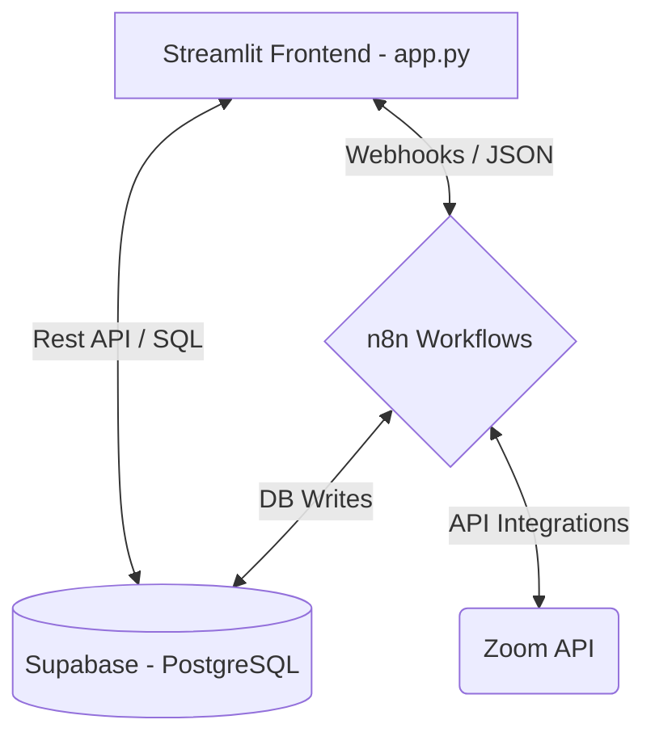

# 📄 Contexto del Proyecto: Asistente de Reuniones (Zoom2)

Este archivo sirve como base de conocimiento y contexto para el desarrollo continuo de la aplicación. Aquí se detalla la arquitectura, el diseño de la base de datos, la lógica del frontend en Streamlit, los flujos en n8n y los pasos para levantar el entorno de desarrollo.

---

## 📌 Descripción General
El proyecto **Asistente de Reuniones (Zoom2)** es una aplicación web interactiva que permite a los usuarios:
1. **Crear y programar reuniones** a través de un chat con lenguaje natural estructurado, enlazándose automáticamente con **Zoom** y guardando los datos en base de datos.
2. **Gestionar usuarios y suscripciones** (niveles Básico, Pro y Enterprise).
3. **Controlar los participantes** de cada reunión y el estado de sus invitaciones.
4. **Generar resúmenes inteligentes (IA)** de las reuniones:
   - Para reuniones **virtuales o mixtas**, llamando a flujos de IA de n8n.
   - Para reuniones **presenciales**, subiendo el acta en formato PDF para que n8n la procese e inserte el resumen.
5. **Gestionar tareas y acuerdos** surgidos en las reuniones (con tableros métricos, gráficos interactivos de Altair, filtros avanzados y descarga en PDF).
6. **Monitorear el rendimiento de la integración con n8n** mediante un panel de métricas (tiempos de respuesta, tasa de éxito y logs detallados).

---

## 🏗️ Arquitectura del Sistema

El sistema utiliza tres componentes principales interconectados:



1. **Frontend (Streamlit)**: Desarrollado en `app.py`. Maneja la interfaz gráfica, el estado de la sesión, la renderización de tablas editables (`st.data_editor`), gráficos estadísticos y exportación de reportes PDF.
2. **Base de Datos (Supabase)**: Base de datos relacional Postgres administrada a través de REST API de Supabase, que almacena usuarios, reuniones, participantes, tareas, resúmenes y métricas.
3. **Automatización y Procesamiento (n8n)**: Motor de flujos de trabajo que orquesta la creación de reuniones en Zoom, el procesamiento de audio/texto de reuniones virtuales para generar resúmenes con IA y el procesamiento OCR de actas PDF presenciales.

---

## 💾 Modelo de Base de Datos (Supabase)

Las tablas y restricciones de la base de datos PostgreSQL se encuentran detalladas a continuación:

### 1. `usuarios`
Almacena la información de registro y nivel de suscripción de los usuarios de la plataforma.
- `id` (UUID, PK, Default: `gen_random_uuid()`)
- `nombre` (TEXT, NOT NULL)
- `correo` (VARCHAR(255), UNIQUE, NOT NULL)
- `password_hash` (TEXT, NOT NULL) - Contraseña cifrada con `bcrypt`.
- `nivel_suscripcion` (VARCHAR(20), Default: `'basico'`) - Valores: `'basico'`, `'pro'`, `'enterprise'`.
- `estado_suscripcion` (VARCHAR(20), Default: `'activo'`) - Valores: `'activo'`, `'pendiente'`, `'cancelado'`, `'suspendido'`.
- `fecha_creacion` (TIMESTAMPTZ, Default: `NOW()`)

### 2. `reuniones`
Contiene la información de las reuniones creadas desde el asistente de chat o de forma manual.
- `id` (UUID, PK, Default: `gen_random_uuid()`)
- `creador_id` (UUID, FK -> `usuarios.id`, ON DELETE RESTRICT)
- `tema` (TEXT, NOT NULL)
- `fecha_inicio` (TIMESTAMPTZ, NOT NULL)
- `duracion_minutos` (INTEGER, NOT NULL)
- `proveedor` (VARCHAR(20), Default: `'zoom'`)
- `id_externo` (VARCHAR(255), UNIQUE) - ID de la reunión en Zoom.
- `join_url` (TEXT) - Enlace para que se unan los participantes.
- `start_url` (TEXT) - Enlace de inicio del anfitrión.
- `estado` (VARCHAR(20), Default: `'programada'`) - Valores: `'programada'`, `'completada'`, `'cancelada'`.
- `tipo` (VARCHAR(20), Default: `'virtual'`) - Valores: `'virtual'`, `'presencial'`, `'mixta'`.
- `direccion` (TEXT) - Ubicación física en caso de reuniones presenciales/mixtas.
- `fecha_creacion` (TIMESTAMPTZ, Default: `NOW()`)

### 3. `participantes`
Mapea la relación de asistencia e invitación a las reuniones.
- `id` (UUID, PK, Default: `gen_random_uuid()`)
- `reunion_id` (UUID, FK -> `reuniones.id`, ON DELETE CASCADE)
- `usuario_id` (UUID, FK -> `usuarios.id`, Nullable)
- `correo` (VARCHAR(255), NOT NULL)
- `rol` (VARCHAR(20), Default: `'participante'`) - Valores: `'participante'`, `'organizador'`.
- `estado_invitacion` (VARCHAR(20), Default: `'enviado'`) - Valores: `'enviado'`, `'aceptado'`, `'rechazado'`.
- `fecha_creacion` (TIMESTAMPTZ, Default: `NOW()`)
*Restricción de unicidad*: `UNIQUE (reunion_id, correo)` para evitar invitaciones duplicadas.

### 4. `resumenes`
Almacena las transcripciones sintetizadas o actas resumidas de las reuniones (Relación 1:1 con `reuniones`).
- `id` (UUID, PK, Default: `gen_random_uuid()`)
- `reunion_id` (UUID, FK -> `reuniones.id`, UNIQUE, ON DELETE CASCADE)
- `resumen` (TEXT) - Texto generado por IA o extraído del acta.
- `fecha_creacion` (TIMESTAMPTZ, Default: `NOW()`)

### 5. `tareas`
Tareas de seguimiento asignadas a correos específicos a partir de los acuerdos de las reuniones.
- `id` (UUID, PK, Default: `gen_random_uuid()`)
- `reunion_id` (UUID, FK -> `reuniones.id`, ON DELETE CASCADE)
- `descripcion` (TEXT, NOT NULL)
- `asignado_a_correo` (VARCHAR(255))
- `estado` (VARCHAR(20), Default: `'pendiente'`) - Valores: `'pendiente'`, `'en_progreso'`, `'completada'`.
- `fecha_vencimiento` (TIMESTAMPTZ)
- `fecha_creacion` (TIMESTAMPTZ, Default: `NOW()`)

### 6. `metricas_n8n`
Registro de telemetría y diagnóstico para llamadas externas de n8n.
- `id` (UUID, PK, Default: `gen_random_uuid()`)
- `endpoint` (VARCHAR(100)) - Endpoint consultado (ej: `crear_reunion_chat`, `resumen_virtual`, `resumen_presencial`).
- `tiempo_respuesta` (NUMERIC) - Tiempo en segundos.
- `estado` (VARCHAR(20)) - Valores: `'éxito'`, `'error'`, `'en_proceso'`, `'timeout'`.
- `codigo_estado` (INTEGER) - Código HTTP.
- `reunion_id` (UUID)
- `tamano_respuesta` (INTEGER) - Tamaño en bytes.
- `detalles` (TEXT) - Excepciones o logs de depuración.
- `fecha` (TIMESTAMPTZ, Default: `NOW()`)

---

## 🎛️ Estructura del Frontend (`app.py`)

La interfaz está dividida en las siguientes vistas navegables según el rol del usuario actual:

### Menú de Navegación:
- **Chat**: Interfaz conversacional para programar reuniones enviando solicitudes a n8n.
- **Usuarios** (*Solo visible para Administradores*): Panel CRUD y tabla interactiva para editar niveles de suscripción, eliminar usuarios o exportar reportes en PDF.
- **Reuniones**: Lista y editor de reuniones agendadas. Los administradores pueden reprogramar, cambiar tipos, definir direcciones físicas o borrar registros.
- **Tareas**: Panel ejecutivo con métricas de completitud, visualizaciones en Altair (tareas por estado, cargas por usuario, creación histórica), grilla interactiva para editar asignaciones/vencimientos y exportación a PDF.
- **Resumen de reuniones**: Vista dividida en tres columnas (Virtual, Presencial, Mixta) para seleccionar una reunión y:
  - Generar resumen con IA directamente para virtuales/mixtas.
  - Subir PDF de acta para presenciales e iniciar consulta recursiva (polling) mientras n8n procesa.
- **Participantes**: Consulta y edición de correos invitados, roles y estados de invitación.
- **Métricas**: Gráficos de Plotly express para auditar el desempeño de n8n (peticiones diarias, tiempos de respuesta promedio, logs detallados).
- **Cerrar sesión**: Limpia el estado y redirige al inicio.

> [!IMPORTANT]
> El rol de administrador está controlado por la función `is_admin()`, la cual valida si el correo del usuario logueado coincide exactamente con:
> `juanaureliodelacruzgamarra@gmail.com`.

---

## 🤖 Flujos de Integración n8n

El archivo `json n8n/AsistenteIA1.json` contiene la definición de flujos que se deben importar en la instancia de n8n cloud o local. Los flujos reaccionan a los siguientes eventos:

1. **Creación de Reunión vía Chat**:
   - Webhook apuntado por `N8N_CREATE_MEETING_WEBHOOK_URL`.
   - Recibe: `{"creador_id": "...", "mensaje": "..."}`.
   - Procesa con un LLM para extraer parámetros (tema, fecha, duración, invitados).
   - Genera enlace en la API de Zoom.
   - Inserta la reunión y participantes en la base de datos de Supabase y retorna un JSON con el resultado estructurado.
2. **Generación de Resumen Virtual/Mixto**:
   - Webhook apuntado por `N8N_RESUMEN_VIRTUAL_WEBHOOK_URL`.
   - Recibe: `{"reunion_id": "..."}`.
   - Procesa la información de la reunión y su transcripción para guardarla en la tabla `resumenes` de Supabase.
3. **Procesamiento de Acta Presencial (PDF)**:
   - Webhook apuntado por `N8N_RESUMEN_PRESENCIAL_WEBHOOK_URL`.
   - Recibe un multipart/form-data con un archivo PDF y `reunion_id`.
   - Extrae el texto del documento, lo sintetiza mediante IA y realiza un insert/patch en la tabla `resumenes` de Supabase.

---

## 🛠️ Configuración e Instalación del Entorno

Sigue estos pasos para poner en marcha la aplicación localmente:

### 1. Requisitos Previos
- Python 3.10 o superior instalado.
- Cuenta en Supabase con una base de datos PostgreSQL activa.
- Instancia activa de n8n (Cloud o Local).

### 2. Configurar la Base de Datos (Supabase)
Ejecuta los scripts ubicados en la carpeta `querys para supabase/` en el **SQL Editor** de Supabase en el siguiente orden:
1. `query1.txt`: Crea la estructura base de tablas (`usuarios`, `reuniones`, `participantes`, `tareas`, `resumenes`).
2. `query2.txt`: Agrega la restricción `no_duplicate_invitations`.
3. `query3.txt`: Inserta usuarios iniciales de prueba (contraseñas cifradas).
4. `query4.txt`: Configura políticas básicas de RLS para pruebas.
5. `insert_sample_tasks.sql`: Inserta un set de datos de prueba de 100 tareas para poblar el panel analítico.

### 3. Variables de Entorno (`.env`)
Crea un archivo `.env` en la raíz del proyecto con la siguiente estructura:
```env
SUPABASE_URL=https://tu-proyecto.supabase.co
SUPABASE_ANON_KEY=tu-clave-anonima-de-supabase

# Webhooks de n8n
N8N_CREATE_MEETING_WEBHOOK_URL=https://tu-n8n.com/webhook/crear-reunion
N8N_RESUMEN_VIRTUAL_WEBHOOK_URL=https://tu-n8n.com/webhook/resumen-virtual
N8N_RESUMEN_PRESENCIAL_WEBHOOK_URL=https://tu-n8n.com/webhook/resumen-presencial
```

### 4. Instalación de Dependencias
Abre una terminal PowerShell en el directorio raíz del proyecto y ejecuta:
```powershell
# Crear y activar entorno virtual
python -m venv .venv
.\.venv\Scripts\Activate.ps1

# Actualizar pip e instalar dependencias
python -m pip install --upgrade pip
pip install -r requirements.txt

# Solución de problemas comunes con bcrypt
pip uninstall bcrypt -y
pip install passlib[bcrypt]
pip install "bcrypt==4.0.1"
pip install pandas
```

### 5. Ejecutar la Aplicación
```powershell
streamlit run app.py
```
La aplicación se abrirá en `http://localhost:8501`.

---

## 📝 Historial de Tareas y Cambios Recientes
- **Integración de Vista de Tareas**: Se diseñó e implementó la función `view_tareas()` en `app.py` que incluye la lógica de actualización en lote mediante `st.data_editor` y el renderizado de gráficos de Altair, acoplada al script de prueba `insert_sample_tasks.sql` que inyecta 100 tareas aleatorias realistas.
- **Registro de Métricas**: Implementación de la función `registrar_metrica_n8n` para registrar todos los consumos a los flujos n8n y su posterior visualización en el panel de auditoría.
